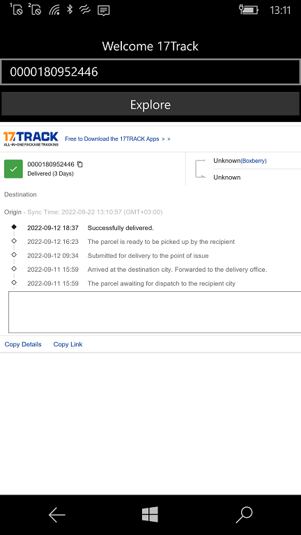

# 17track

The application uses javascript and 17track to display information. Multi-platform Xamarin Forms "framework" used.

## Screenshots

## 2 words 

Demonstration of the capabilities of the WebView component (browser) using javascript in C#.

This application created on Xamarin Forms is used for the parcel tracking service 17track.

## Tech details

Accepted platforms: Android, W10/W10M, iOS

## Links
http://www.17track.net/en

## ================================================================================================================

# 17track

Приложение использует javascript и 17track для отображения информации. Разработано с применением мультиплатформенной технологии Xamarin-Forms.

## Пару слов

Демонстрация возможностей компонента WebView (браузер) с использованием javascript на C#. 

Это созданное на Xamarin Forms приложение используется для сервиса трегинга посылок 17track.

## Тех. детали

Допустимые платформы: Android, W10/W10M, iOS

## Ссылки 
http://www.17track.net/ru

## ..

AS IS. No support. RnD only.

## .

[m][e] 2002
